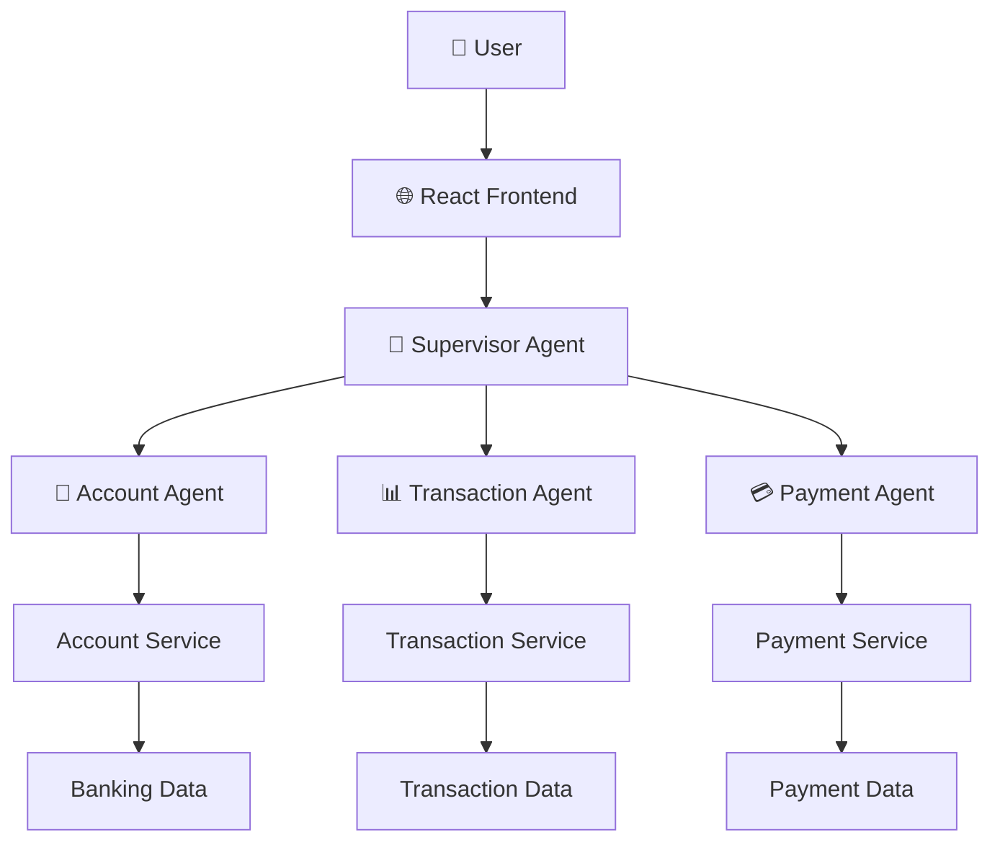
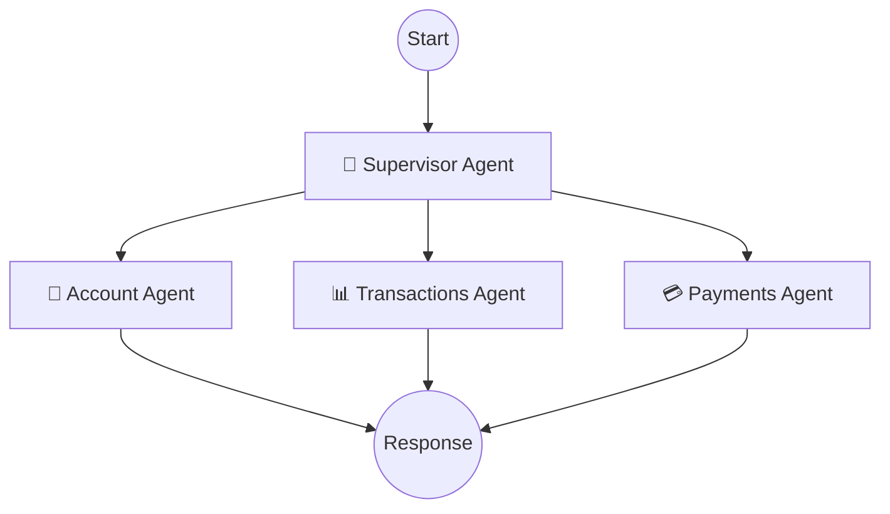

# AI Banking Management System

<div align="center">

# 🤖 AI Banking Management System

### Intelligent Multi-Agent Banking Assistant

A conversational banking management system built with **Java, Spring Boot, React, and AI-powered multi-agent workflows**.

The system provides a unified interface for interacting with banking services such as account information, transaction history, payment management, and related banking operations.

</div>

---

## 📌 Overview

The **AI Banking Management System** is a conversational banking platform designed to simplify common banking operations through an intelligent multi-agent architecture.

Instead of navigating through multiple banking screens and services, users can interact with the system through a natural-language conversational interface.

The application interprets the user's request, identifies the appropriate banking operation, and routes the request to a specialized agent responsible for handling that particular task.

The system is organized around three major banking capabilities:

* 🏦 **Account Management**
* 📊 **Transaction Management**
* 💳 **Payment Management**

A central **Supervisor Agent** coordinates these specialized agents and determines which component should handle each incoming request.

---

## ✨ Key Features

* 🤖 **Multi-Agent Banking Architecture**
* 🧠 **AI-powered request routing**
* 🏦 Account information and balance management
* 📊 Transaction history and transaction search
* 💳 Payment and beneficiary management
* 🔎 Tool-based interaction with backend services
* 🧩 Modular Spring Boot microservices
* 🌐 React-based conversational interface
* 📁 Invoice and document processing support
* 🔐 Separation between AI agents and business services
* 🔄 REST API based service communication
* 🛠️ Extensible agent and tool architecture

---

# 🏗️ System Architecture

The application follows a **multi-agent architecture** in which each agent is responsible for a specific banking domain.



---

# 🧠 Multi-Agent Workflow

The system uses a supervisor-based workflow to coordinate different banking agents.



The **Supervisor Agent** receives the user's request and determines which specialized agent is appropriate for the task.

For example:

| User Request                          | Responsible Agent  |
| ------------------------------------- | ------------------ |
| "What is my account balance?"         | Account Agent      |
| "Show my recent transactions"         | Transactions Agent |
| "What payment methods are available?" | Account Agent      |
| "Show transactions from last month"   | Transactions Agent |
| "I want to make a payment"            | Payments Agent     |
| "Process this invoice"                | Payments Agent     |

This approach keeps individual agents focused on their respective responsibilities instead of requiring one large agent to manage every banking operation.

---

# 🤖 Agents

## 🧠 Supervisor Agent

The Supervisor Agent acts as the central coordinator of the application.

Its primary responsibilities include:

* Understanding the user's request
* Identifying the required banking operation
* Selecting the appropriate specialized agent
* Routing the request
* Coordinating the final response

The supervisor provides a single conversational entry point while allowing the underlying banking functionality to remain modular.

---

## 🏦 Account Agent

The Account Agent handles operations related to banking account information.

### Responsibilities

* Retrieve account information
* Check account balance
* Retrieve account identifiers
* View registered payment methods
* Retrieve beneficiary information
* Handle account-related queries

The agent interacts with the Account Service through available tools and APIs.

---

## 📊 Transactions Agent

The Transactions Agent is responsible for transaction-related operations.

### Responsibilities

* Retrieve transaction history
* Search transactions
* Filter transaction records
* Identify incoming and outgoing transactions
* Retrieve transactions associated with specific recipients
* Present transaction information conversationally

This agent communicates with the transaction-related backend services to obtain the required information.

---

## 💳 Payments Agent

The Payments Agent manages payment-related operations.

### Responsibilities

* Initiate payment workflows
* Retrieve available payment methods
* Retrieve beneficiary information
* Validate payment-related information
* Process payment requests
* Check previous transactions
* Support invoice-based payment workflows

The payment workflow can interact with multiple backend services when completing a payment operation.

---

# 🔧 Backend Services

The banking functionality is separated into independent backend services.

This separation allows the AI layer to interact with business functionality without directly embedding business logic inside the agents.

### Account Service

Responsible for account-related operations.

Typical responsibilities include:

* Account lookup
* Balance retrieval
* Payment method retrieval
* Beneficiary retrieval
* Account information management

---

### Transaction Service

Responsible for transaction-related operations.

Typical responsibilities include:

* Transaction retrieval
* Transaction searching
* Transaction filtering
* Recipient-based transaction lookup
* Transaction history management

---

### Payment Service

Responsible for payment-related operations.

Typical responsibilities include:

* Payment submission
* Payment processing
* Payment status handling
* Payment-related transaction creation

---

# 🔄 Request Processing Flow

A typical request follows this flow:

```text
User
  │
  ▼
React Frontend
  │
  ▼
Supervisor Agent
  │
  ├──────────────► Account Agent
  │                    │
  │                    ▼
  │               Account Service
  │
  ├──────────────► Transactions Agent
  │                    │
  │                    ▼
  │              Transaction Service
  │
  └──────────────► Payments Agent
                       │
                       ▼
                  Payment Service
```

The architecture separates **conversation handling**, **agent reasoning**, and **business operations** into different layers.

---

# 🧩 Technology Stack

## Backend

| Technology               | Purpose                                  |
| ------------------------ | ---------------------------------------- |
| ☕ Java                   | Core programming language                |
| 🌱 Spring Boot           | Backend application framework            |
| 🔗 REST APIs             | Communication between services           |
| 🧠 LangChain4j           | AI agent and tool integration            |
| 🔄 LangGraph4j           | Agent workflow orchestration             |
| 🔌 MCP / Tool Interfaces | Exposing backend functionality to agents |
| 📦 Maven                 | Dependency and project management        |

---

## Frontend

| Technology           | Purpose                             |
| -------------------- | ----------------------------------- |
| ⚛️ React             | User interface                      |
| 💬 Conversational UI | Natural-language interaction        |
| 📤 File Upload       | Invoice/document submission         |
| 🌐 REST Integration  | Communication with backend services |

---

## AI Layer

The AI layer is responsible for:

* Natural-language understanding
* Intent identification
* Agent selection
* Tool selection
* Multi-agent workflow execution
* Conversational responses

The multi-agent approach allows different banking operations to be implemented independently while maintaining a unified user experience.

---

# 📂 Project Structure

```text
AI-Banking-Management-System/
│
├── frontend/
│   ├── src/
│   ├── public/
│   └── package.json
│
├── copilot/
│   ├── src/
│   │   └── main/
│   │       └── java/
│   └── pom.xml
│
├── business-api/
│   │
│   ├── account/
│   │   ├── src/
│   │   └── pom.xml
│   │
│   ├── payment/
│   │   ├── src/
│   │   └── pom.xml
│   │
│   └── transaction/
│       ├── src/
│       └── pom.xml
│
├── docs/
│   ├── architecture/
│   └── assets/
│
├── pom.xml
│
└── README.md
```

---

# 🔌 Tool-Based Architecture

The AI agents do not directly manipulate backend data.

Instead, agents interact with defined tools and APIs exposed by the business services.

For example:

```text
User Request
     │
     ▼
Supervisor Agent
     │
     ▼
Specialized Agent
     │
     ▼
Tool Selection
     │
     ▼
Business API
     │
     ▼
Banking Data
     │
     ▼
Agent Response
     │
     ▼
User
```

This separation provides a cleaner architecture and makes it easier to add additional banking capabilities in the future.

---

# 📄 Invoice Processing

The payment workflow can support document-based payment scenarios.

A user can provide an invoice or payment document through the conversational interface.

The general workflow is:

```text
Invoice / Document
        │
        ▼
Document Processing
        │
        ▼
Extract Relevant Information
        │
        ▼
Payment Agent
        │
        ▼
Validate Payment Details
        │
        ▼
Payment Service
        │
        ▼
Payment Result
```

This allows document information to become part of the conversational payment workflow rather than requiring users to manually enter every piece of information.

---

# 🛠️ Core Design Principles

### 1. Modular Architecture

Each banking domain is separated into its own service and agent.

### 2. Specialized Agents

Agents focus on specific responsibilities rather than attempting to perform every operation.

### 3. Centralized Routing

The Supervisor Agent provides a single entry point for user requests.

### 4. Service Separation

Business logic remains within backend services while AI agents interact through defined interfaces.

### 5. Extensibility

New agents and banking services can be added without redesigning the entire application.

### 6. Conversational Interaction

Users can interact with banking functionality using natural-language requests.

---

# 🚀 Getting Started

## Prerequisites

Make sure the following tools are installed:

* Java 17 or later
* Maven 3.8+
* Node.js
* npm
* Git
* Docker *(if required by the local setup)*

---

## 1. Clone the Project

```bash
git clone <repository-url>
cd AI-Banking-Management-System
```

---

## 2. Build the Backend

From the project root:

```bash
mvn clean install
```

---

## 3. Start the Backend Services

Start the required Spring Boot services according to the project configuration.

For an individual service:

```bash
mvn spring-boot:run
```

---

## 4. Start the Frontend

Navigate to the frontend directory:

```bash
cd frontend
```

Install dependencies:

```bash
npm install
```

Start the development server:

```bash
npm start
```

---

# 💬 Example Interactions

### Account Information

```text
User:
What is my current account balance?

Assistant:
The Account Agent retrieves the relevant account information
and provides the balance through the conversational interface.
```

### Transaction History

```text
User:
Show me my recent transactions.

Assistant:
The request is routed to the Transactions Agent,
which retrieves the relevant transaction records.
```

### Payment

```text
User:
I want to make a payment.

Assistant:
The request is routed to the Payments Agent,
which coordinates the required payment operations.
```

### Invoice Payment

```text
User:
I want to pay this invoice.

User:
[Uploads invoice]

Assistant:
The payment workflow processes the document,
extracts the relevant information, and continues
with the payment operation.
```

---

# 🔐 Security Considerations

The system is structured so that AI agents operate through controlled tools and backend APIs rather than directly accessing underlying data stores.

Important security considerations for a production banking application include:

* Authentication
* Authorization
* Secure API communication
* Input validation
* Secure credential management
* Sensitive-data protection
* Transaction authorization
* Audit logging
* Rate limiting
* Secure document processing

The project is intended as a software architecture and AI-agent demonstration and should not be treated as a production banking platform without additional security controls and compliance requirements.

---

# 🔮 Future Enhancements

The architecture can be extended with additional banking capabilities such as:

* 📈 Financial insights
* 💰 Budget tracking
* 🔔 Transaction notifications
* 📊 Spending analysis
* 💳 Card management
* 🏦 Loan information
* 📅 Scheduled payments
* 🔎 Fraud detection
* 📱 Mobile banking interface
* 🔐 Advanced authentication
* 📑 Financial report generation

Additional specialized agents can also be introduced as the system grows.

For example:

```text
                   Supervisor
                       │
        ┌──────────────┼──────────────┐
        │              │              │
     Account      Transactions     Payments
        │              │              │
        └──────────────┼──────────────┘
                       │
              Future Specialized Agents
                       │
        ┌──────────────┼──────────────┐
        │              │              │
      Fraud        Analytics        Support
      Agent          Agent           Agent
```

---

# 📊 Architecture Summary

| Layer                   | Responsibility                               |
| ----------------------- | -------------------------------------------- |
| 🌐 Frontend             | User interaction and conversation            |
| 🧠 Supervisor           | Request understanding and routing            |
| 🤖 Specialized Agents   | Domain-specific banking operations           |
| 🔧 Tools                | Controlled access to business functionality  |
| 🌱 Spring Boot Services | Banking business logic                       |
| 🗄️ Data Layer          | Account, transaction and payment information |

---

# 🎯 Project Objective

The primary objective of this project is to demonstrate how **generative AI, multi-agent workflows, and modular backend services** can be combined to create an intelligent banking management interface.

Rather than building a single large AI component, the system divides banking functionality into specialized agents and services.

This makes the architecture easier to understand, extend, test, and maintain while providing users with a unified conversational experience.

---

# 🧪 Development & Testing

The application can be tested by sending different categories of banking requests through the conversational interface.

Example test categories:

```text
Account
 ├── Balance
 ├── Account details
 ├── Payment methods
 └── Beneficiaries

Transactions
 ├── Recent transactions
 ├── Transaction search
 ├── Recipient search
 └── Transaction history

Payments
 ├── Payment request
 ├── Payment details
 ├── Invoice processing
 └── Payment confirmation
```

Testing these categories helps verify that requests are routed to the appropriate agent and that the corresponding backend services are invoked correctly.

---

# 📌 Conclusion

The **AI Banking Management System** demonstrates a modular approach to building conversational banking applications using AI agents and backend microservices.

The combination of a **Supervisor Agent**, specialized banking agents, tool-based service interaction, Spring Boot APIs, and a React interface provides a foundation for building intelligent financial applications.

The architecture is designed to remain extensible, allowing additional agents, services, and banking capabilities to be incorporated as the application evolves.

---

<div align="center">

### 🤖 AI Banking Management System

**Conversational Banking • Multi-Agent Architecture • Modular Services**

</div>
